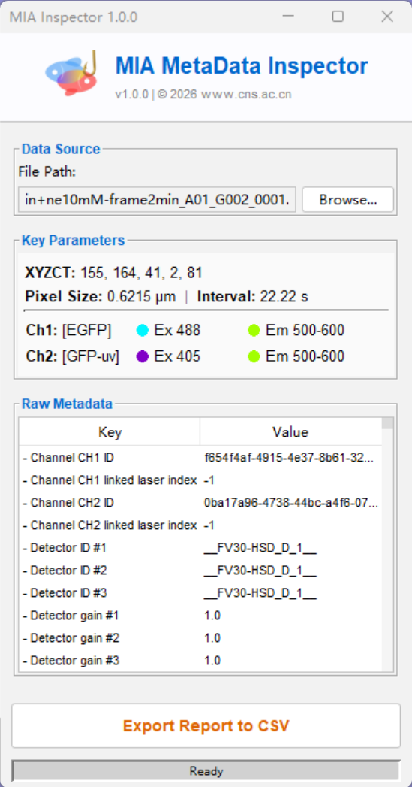

# MIA: Metadata Inspection Analyzer

**MIA (Microscopy Information Assistant)** is a streamlined, user-friendly tool designed for biologists to instantly extract hidden metadata from microscopy files without writing a single line of code.

> 🧩 **Part of the Biosensor Tools Suite**
> (Includes: FIA, RIA, NIA, MIA, WinMan)

## 🚀 Key Features

* **🔍 Instant Inspection**: Drag & Drop any microscopy file to immediately view dimensions (XYZT), pixel size, and time intervals.
* **🌈 Spectrum Mapping**: Auto-generates color-coded tags for Excitation/Emission wavelengths (e.g., ● Ex488), making channel identification effortless.
* **🧠 Deep Extraction**:
    * **Olympus (.oir)**: Advanced parsing of proprietary tags (Exact Laser Lines, Emission Ranges, Real-Time Intervals).
    * **General (.czi, .lif, .nd2)**: Standard OME-XML support via Bio-Formats integration.
* **📊 One-Click Reporting**: Export a comprehensive CSV report (Excel compatible) containing both the summary and the full raw metadata tree.

## 📥 Installation

You can install MIA via the **Fiji Update Site** (Recommended) or by manually downloading the JAR file.

### Method 1: Fiji Update Site (Recommended)
Stay up-to-date automatically with the Biosensor Tools suite.

1.  Open **Fiji**.
2.  Go to `Help > Update...` and wait for the check to finish.
3.  Click `Manage update sites`.
4.  Click `Add Unlisted Site`.
5.  Enter the following information:
    * **Name:** `Biosensor Tools`
    * **URL:** `https://sites.imagej.net/Biosensor-Tools/`
6.  Click **Close** > **Apply changes**.
7.  Restart Fiji.

### Method 2: Manual Installation
1.  Download `MIA-x.y.z.jar` from the [Releases](https://github.com/Epivitae/MIA-Metadata-Inspection-Analyzer/releases) page.
2.  Drag the `.jar` file directly into your **Fiji/ImageJ** main window (or copy it to the `plugins/` folder).
3.  Restart Fiji.

*Find the tool under:* `Plugins > Biosensor Tools > MIA`

## 🎮 Usage

1.  **Launch** the plugin from the plugins menu.
2.  **Drag and drop** a microscopy file (`.oir`, `.czi`, etc.) into the MIA window.
3.  Review the **Key Parameters** summary panel.
4.  Click **Export Report** to save all metadata to a local CSV file.

## 🛠️ Supported Formats

| Format | Extension | Support Level |
| :--- | :--- | :--- |
| **Olympus** | `.oir` | **Full** (Hybrid Raw Parsing & OME) |
| **Zeiss** | `.czi` | Standard (OME-XML) |
| **Leica** | `.lif` | Standard (OME-XML) |
| **Nikon** | `.nd2` | Standard (OME-XML) |
| **Others** | `.tiff`, etc. | Basic Bio-Formats Support |

## ⚖️ License

MIT License. Copyright (c) 2026 Dr. Kui Wang.